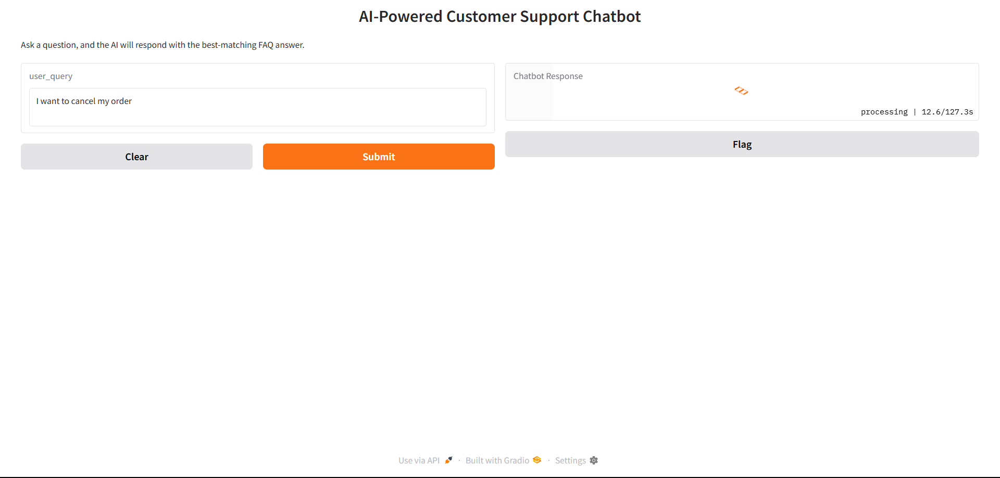

🤖 Customer Support Chatbot

A FastAPI and Gradio-based customer support chatbot that intelligently answers user queries using an LLM (LLaMA2 via Ollama) and a predefined FAQ database. Ideal for automating customer service with smart, human-like responses.

---

## 🚀 Features

- ✅ Matches user queries with closest FAQ entries using LLM  
- 🎯 FastAPI backend API for easy integration  
- 🧠 LLaMA2 model via Ollama for natural language understanding  
- 🧾 Gradio frontend for quick demo and testing  
- 🌐 Multi-language support placeholder (default: English)  
- 📦 Easily customizable FAQ knowledge base  

---

## 🛠️ Tech Stack

| Tool        | Purpose                                   |
|-------------|-------------------------------------------|
| **Python**  | Core language                             |
| **FastAPI** | Backend API framework                     |
| **Gradio**  | Frontend UI for chatbot interface         |
| **Ollama**  | Running LLaMA2 model locally via API      |
| **LLaMA2**  | Language model for understanding queries  |
| **Requests**| HTTP requests to interact with Ollama     |

---

## 📁 Project Structure

